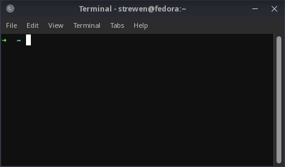
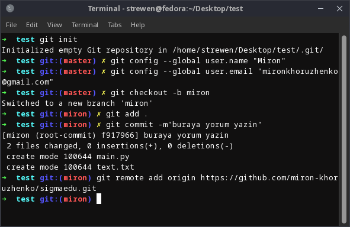
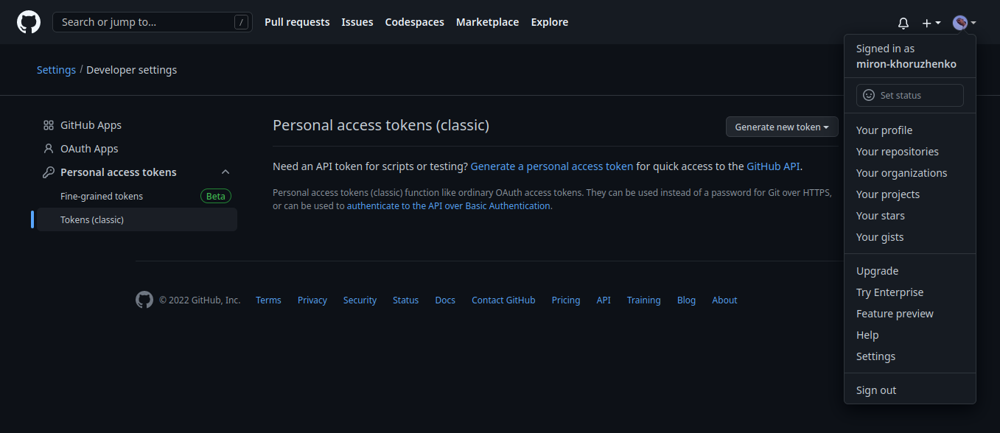
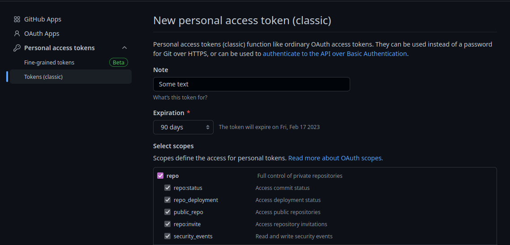

# Fast start

- [Fast start](#fast-start)
	- [CMD ve/veya Terminal nedir?](#cmd-veveya-terminal-nedir)
	- [Git init or Git clone](#git-init-or-git-clone)
	- [Git commit](#git-commit)
	- [Tokens](#tokens)
	- [Git push](#git-push)
	- [Uploads](#uploads)

## CMD ve/veya Terminal nedir?

İkisi de bir komut satırı ve arayüzle çalışmadan daha alt seviyede çalışmanızı sağlayan uygulamalarıdır. Arasındaki sizin bilmeniz gereken tek fark, CMD - Windows, Terminal - Linux'te çalışır.

CMD yi açmak için `Win + R` basmanız ve oraya **cmd** yazmanız gerek

`Terminal`



`CMD görünümü`


CMD de solda görüğünüz `C:/Users/>` bulunduğunuz konumu gösterir. Ordan kendi konumu değiştirmek için `cd` komutu yazıp yanına yeni konum yazmanız gerek. Mesela

> Konumu yazarken konumun ilk birkaç harf yazıp `Tab` basmayı deneyin 

```bash
cd Desktop/test 
```

Bu yazdığım konum benim bilgisarada masaüstünde kayıtlı test dosyasına gider. Sizde böyle dosya olmayabilir. 

Komutu çalıştırdıktan sonra Yeni konumunuz `C:/Users/Desktop/test` olacak. Ayni şekilde kendi proje dosyanıza gidebilirsiniz.

## Git init or Git clone

Git içeren bir dosyayı yaratmak istiyorsanız iki yolu kullanabilirsiniz.

1. Normal dosyayı yaratıp oraya giti tanımlamak (git init)
2. Github'ta boş bir repository (bundan sonra repo) tanımlayıp onu kendi bilgisayarınıza çekmek (git clone)

## Git commit

Sizin projeyi içeren bir dosyanız mevcut varsayalım. İlk yapmanız gereken, o dosyayı CMD ya da Terminal üzerinden açmanızdır. 

```powershell
Microsoft Windows [Version 10.0.19045.2251]
(c) Microsoft Corporation. Tüm hakları saklıdır.

C:\Users\yourName> cd ./path/to/your/folder
```

Dosyaya geldiğinizde oraya `git init` komutuyla giti tanımlayınız. Oluştuğuna dair bir mesaj alacaksınız. 

Eğer git clone yaptıysanız, içerde zaten oluşan bir .git dosyası olur ve git init yapmanıza gerek kalmaz

>Yeni oluşan dosyayı göremiyorsanız, gizli dosyaları göster seçeneği açmanız gerek. "First Name", "yourName" gibi kısımlara dikkat edin. Orda sizin isimleriniz olacak.

Sonra bu dosyada birkaç komut çalıştırmanız gerek ($ - sizin input anlamına geliyor yazmaya gerek yok).

>Hatalara dikkat edin. Hata aldıysanız okuyun ve düzeltmeyi çalışın

```bash
$ git config --global user.name "FIRST_NAME LAST_NAME"
$ git config --global user.email "MY_NAME@example.com"
$ git checkout -b yourName
$ git add .
$ git commit -m"Some desc text"
$ git remote add origin https://github.com/miron-khoruzhenko/sigmaedu.git
```



Şimdi de satır satır ne yaptığımıza bakalım.

* İlk iki satırda, git için kendimizi tanıttık. Bu bilgiler commitlerde kullanılacak. Onları ilerde bir daha yazmaya gerek kalmaz.
* `git checkout -b` komutuyla yeni bir dal yarattık ve isim olarak kendi ismimizi sesçtik. `git branch` yazıp şu an hangi dalda olduğunuzu öğrenebilirsiniz. olduğunuz branch'ın yanında yıldız olacak. İlerleyen projelerde kendi branch'ını sürekli kontrol edin. O menuden çıkmak için **q** basmanız gerek.
* `git add .` hangi dosyaları yüklemek istediğinizi seçin. Noktayı yazarsanız, dosyada kalan her şeyi alır.
* `git commit -m"comment"` komutuyla da sürümün local bir kopya oluşturuyoruz ve yorum bırakıyoruz.
* Son satırda da, repo linkini origin değişkenine bağlıyoruz. İlerde nereye paylaşmamız gerektiğini belirlemek için link yerine origin yazmamız yeterli olur.


## Tokens

Bundan sonra projeyi paylaşmak için ilk önce kendi bilgisayarımızı github'a bağlamamız gerek. Bunun için github sitesine girmeniz gerek. Sonra da:

Sağ üstte **profile** ikonu -> **settings** -> aşağıda kalan **Developer settings** -> **Personal access tokens** -> Tokens (classic)



girmeniz gerek. Ordan da `Generate new token` düğmesine basın ve `Generate new token (classic)` seçin. Note kısmına bir şeyler yazın **Expiration** seçeneği **90 days** seçin. Aşağıda kalan **Select scopes** kısmında da sadece **repo** seçin.



Karşınıza çıkan ghp ile başlayan kodu kopyalayın ve bir yerde kaydedin. O kodu bir daha göremezsiniz ve kaybetme durumunda yeni bir kod yaratmak zorunda kalırsınız.

## Git push

Bundan sonra termınale dönebiliriz.

```bash
$ git push --set-upstream origin yourName
> Username for 'https://github.com': yourGithub-name
> Password for 'https://yourGitHub-name@github.com': ghp_yourTokenfsdfsdfsdfsdfdsfsfd
```

Her şeyi doğru yaptıysanız, dosya githuba paylaşılmıştır.

## Uploads

Eğer bir şeyi düzeltmek istiyorsanız, her şeyi sıfırdan yapmayı gerek yok. Bu sefer sistem kuruldu ve artık sadece birkaç komut yazıp kendi projenizi düzeltebilirsiniz

```bash
$ git add .
$ git commit -m"Some desc text"
$ git push
```

Ancak hangi branch ta olduğunuzu dikkat edin. Mastera bir şey paylaşmayın. 